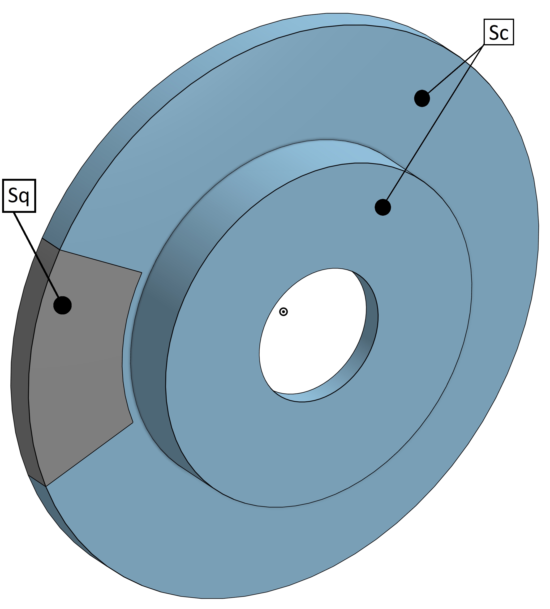
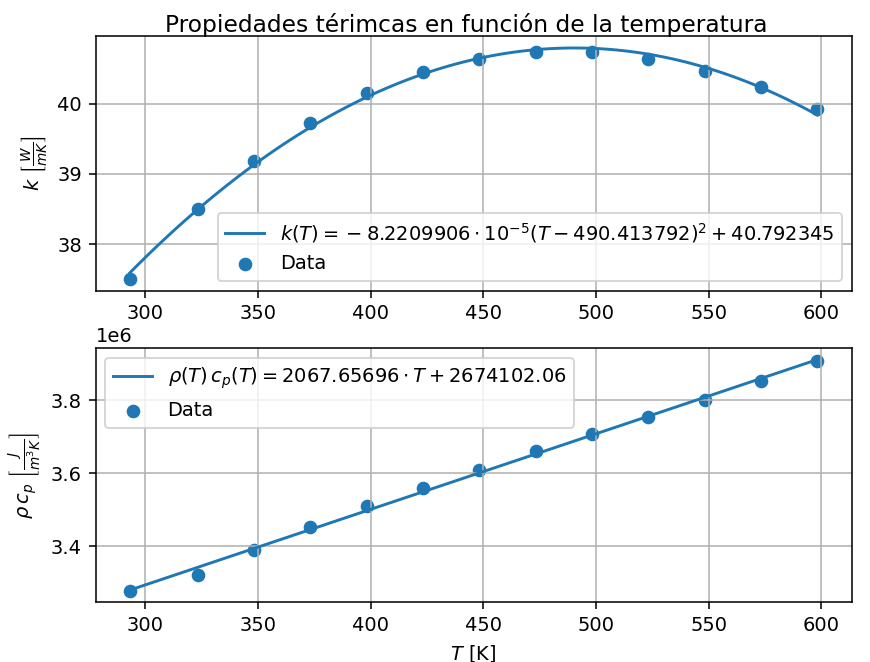
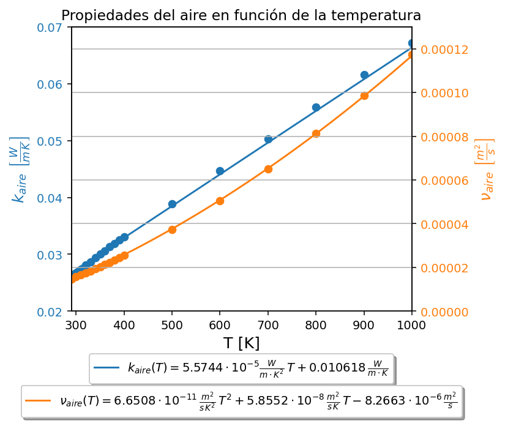

# Simulación de un disco de frenos
Se simula por elementos finitos, un disco de frenos en distintas condiciones de procesos de frenado. Se plantea el problema como uno tridimensional, transitorio, no lineal, con una malla no estructurada de elementos tetragonales, y con una formulación Euleriana, es decir, se considera la velocidad de las partículas del disco en la ecuación diferencial.

La ecuación diferencial que gobierna el problema es:
$$^t\rho \ ^tc_p\frac{\partial ^tT}{\partial t}+\ ^t\rho \ ^tc_p \ ^t\underline{\text{v}_d}\cdot \ ^t\underline{\nabla} \ ^tT = \ ^tk \ ^t\nabla^2 \ ^tT$$

Nota: $^t\phi$ representa la magnitud $\phi$ en el tiempo $t$. Es decir, cuando se coloca el supraíndice $t$ a la izquierda, se trata de una variable dependiente del tiempo. En este caso, se consideran las propiedades del disco como funciones de su temperatura, por eso se colocan los supraíndices $t$ en las propiedades como $\rho$, $c_p$ y $k$ (dado que la temperatura del disco depende del tiempo).

La velocidad total de cada particula del disco es igual a la suma de su velocidad de rotación ($^t\underline{\text{v}_d}$) y la velocidad de traslación del vehículo ($^t\underline{\text{v}_t}$).
$$^t\underline{\text{v}} \ = \ ^t\underline{\text{v}_d} \ + \ ^t\underline{\text{v}_t}$$
$$^t\underline{\text{v}_d} = -\ ^t\omega \ ^ty \ \underline{e_x} + \ ^t\omega \ ^tx \ \underline{e_y}$$
$$^t\underline{\text{v}_t} = -\ ^tV \ \underline{e_x}$$
Se considera una disminución lineal de la velocidad en el proceso de frenado:
$$^tV = V\_0\left(1-\frac{t}{t\_f}\right)\quad\quad^t\omega=\frac{V\_0}{R\_r}\left(1-\frac{t}{t\_f}\right)$$
Siendo $R\_r$ el radio de la rueda.

Por motivos de estabilidad numérica, se considera únicamente la velocidad de rotación de las partículas en la ecuación diferencial. La componente de traslación se toma en cuenta agregando una condición de borde de convección:
$$q\_{\text{conv}}=-\ ^tk \ ^t\underline{\nabla} \ ^tT \cdot \underline{n\_c} = \ ^th_c\left(^tT-T\_{\infty}\right) \quad\quad ^t\underline{\text{x}} \ \in \ S\_c$$
Siendo $S_c$ la superficie del disco expuesta al aire exterior, $\underline{n\_c}$ su normal, y $T\_\infty$ la temperatura de referencia de del aire. El coeficiente de convección se obtiene a partir de la correlación de flujo forzado sobre una placa plana, utilizando únicamente la velocidad de traslación del vehículo. 

Se tiene también una condición de borde del tipo Neumann, que representa la generación de calor por fricción en la superficie de contacto entre la pastilla y el disco de frenos.

$$q=-\ ^tk \ ^t\underline{\nabla} \ ^tT \cdot \underline{n\_q}= \ ^t\kappa \ \frac{m\frac{V_0^2}{t\_f}\left(1-\frac{t}{t_f}\right) - \frac{1}{2}\rho\_\infty \ C\_D \ A\_R \ V_0^3\left(1-\frac{t}{t_f}\right)^3}{8 \ A\_f}\quad\quad ^t\underline{\text{x}} \ \in \ S\_q$$
Siendo:
- $m$ la masa del vehículo
- $V_0$ la velocidad inicial del vehículo
- $t_f$ el tiempo de frenada
- $\rho\_\infty$ la densidad de referencia del aire
- $C\_D \ A\_R$ el coeficiente de Drag por el área de referencia
- $A\_f$ el área de contacto entre pastilla y disco de frenos (área de la superficie $S\_q$ con normal $\underline{n\_q}$)
- $^t\kappa$ un coeficiente que determina qué porción de calor es absorbida por el disco: $^t\kappa=\frac{\sqrt{^tk \ ^tc\_p \ ^t\rho}}{\sqrt{^tk \ ^tc\_p \ ^t\rho} + \sqrt{k\_p \ c\_{p_p} \ \rho\_p}}$ (donde las propiedades con subíndice $p$ son las de la pastilla de frenos)

La deducción del flujo de calor surge de un balance de potencias del vehículo durante el proceso de frenado (se detalla la deducción en el archivo **TP_TCM_Krupiczer_rev2.pdf**)

Para analizar distintas condiciones de procesos de frenados más o menos agresivos, se puede variar la velocidad inicial $V\_0$ y el tiempo de frenada $t\_f$.

Las superficies donde se aplican las condiciones de borde son:

  

Se realiza un análisis no lineal, en el cual las propiedades del disco como su conductividad térmica (k) y el producto de la densidad por el calor específico (ρ cp) dependen de su temperatura.

  

Luego, se realiza también un análisis lineal en el cual se toman propiedades constantes. Se escogen las propiedades correspondientes a la temperatura inicial del disco. Se comparan las soluciones mediante ambos análisis.

En ambos análisis se consideran las propiedades del aire como funciones de la temperatura (a la hora de calcular la temperatura de referencia cuando se busca obtener el coeficiente de convección).

  

En la carpeta **Pre-processing** se detalla todo lo relacionado con la generación de la geometría y de la malla, además de la obtención de las matrices necesarias para empezar a resolver el problema mediante el método de elementos finitos (coordenadas de los nodos y conectividad entre nodos y elementos).

En la carpeta **Processing** se adjuntan todos los códigos necesarios para resolver el problema aplicando el método de elementos finitos. Se calculan las matrices y vectores necesarios, y se resuelve el sistema de ecuaciones diferenciales no lineales, para obtener finalmente las temperaturas en los nodos.

En la carpeta **Post-processing** se tienen los códigos utilizados para producir videos, imágenes de cortes y gráficos (plots) de las temperaturas obtenidas previamente.

En la carpeta **Resultados** se muestran todos los resultados obtenidos mediante los análisis lineal y no lineal.

El archivo **TP_TCM_Krupiczer_rev2.pdf** es un informe en el cual se explica detalladamente todo el procedimiento, paso a paso, desde la deducción del flujo de calor producido por la fricción, hasta el análisis de los resultados y del modelo empleado. Se explican los cálculos de cada matriz y vector, así como la forma de calcular las integrales numéricamente, y los algoritmos empleados para resolver el aspecto transitorio y la no linealidad, manteniendo el sistema numéricamente estable.
