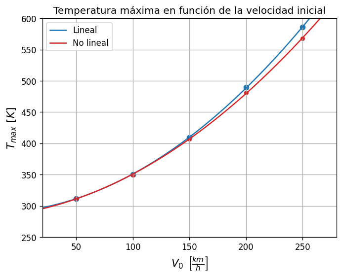

# Resultados
Se muestran los resultados obtenidos mediante análisis lineal (propiedades constantes) y no lineal (propiedades dependientes de la temperatura). 

Además, se comparan las temperaturas máximas obtenidas en cada caso. Se puede observar que a medida que aumenta la velocidad inicial, es decir, a medida que aumenta el calor generado por fricción, las soluciones se alejan cada vez más.

  

  

Aún así, se observa que mismo en caso tan extremo como una frenada con velocidad inicial de 250 km/h en un tiempo de 5 segundos, el error relativo porcentual entre ambas soluciones es tan solo del orden de 3%. 
